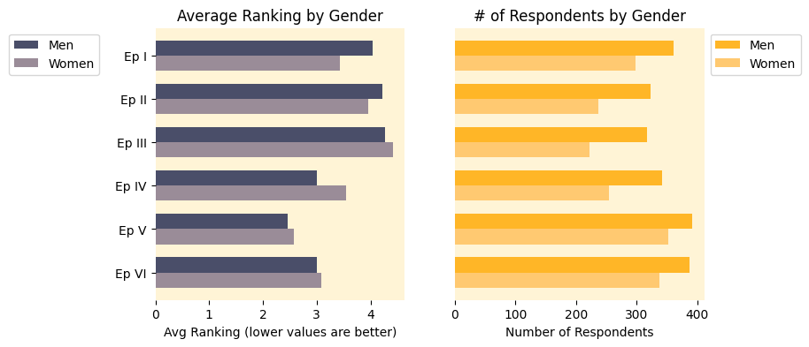
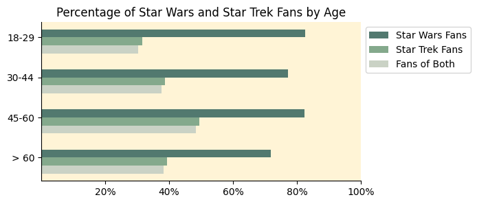
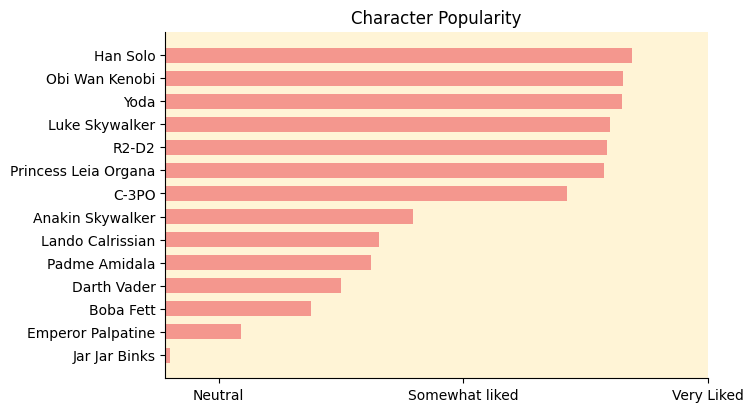

# Star Wars Survey Analysis

This repository contains an analysis of the survey data about Star Wars fans.
The goal is to explore preferences and demographics using Python and data visualization.
This projects is based on [Star Wars Survey Analysis by Dataquest](https://www.youtube.com/watch?v=5bgr1YnLSyk&t=2797s).

## Data

The dataset used comes from [fivethirtyeight/star-wars-survey](https://github.com/fivethirtyeight/data/tree/master/star-wars-survey).
It contains responses from 1187 participants about:

- Favorite Star Wars movies
- Favorite characters
- Demographics (age, gender, location, etc.)

## Example Visualizations

### Movie Ranking

### Percentage of Fans

### Character Popularity

## License

This project is licensed under the [MIT License](LICENSE).
