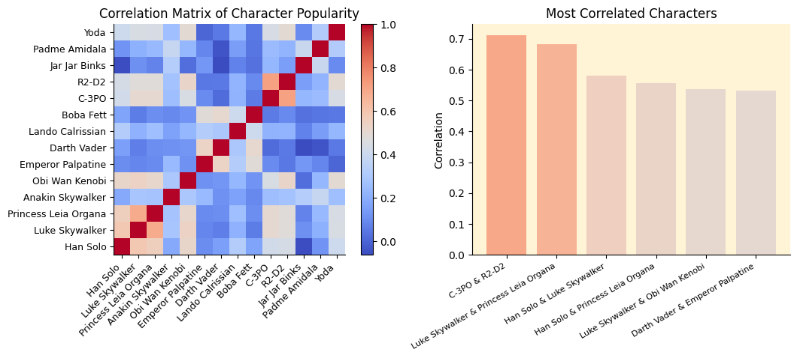

# Star Wars Survey Analysis

This repository contains an analysis of the survey data about Star Wars fans.
The goal is to explore preferences and demographics using Python and data visualization.
This projects is based on [Star Wars Survey Analysis by Dataquest](https://www.youtube.com/watch?v=5bgr1YnLSyk&t=2797s).

## Data

The dataset used comes from [fivethirtyeight/star-wars-survey](https://github.com/fivethirtyeight/data/tree/master/star-wars-survey).
It contains responses from 1187 participants about:

- Favorite Star Wars movies
- Favorite characters
- Demographics (age, gender, location, etc.)

## Example Visualizations

### Movie Ranking

After visualizing the data, we can see that both men and women have somewhat of the same opinion on the best Star Wars movies. We can also see that the original trilogy (Ep IV-VI) is more popular than the prequel trilogy (Ep I-III).

### Relationship between Star Wars and Star Trek Fans

After analysis, we can see that almost every Star Trek fan is also a Star Wars fan.

### Character Popularity

I mean, who likes Jar Jar Binks?

### Correlation of Character Popularity

By calculating the correlation of Star Wars characters, we can visually represent similar characters. The highest correlations between characters (as you can see on the right graph) were found to be:

1. C-3PO & R2-D2
2. Luke Skywalker & Princess Leia Organa
3. Han Solo & Luke Skywalker
4. Han Solo & Princess Leia Organa
5. Luke Skywalker & Obi Wan Kenobi
6. Darth Vader & Emperor Palpatine

If you know something of Star Wars, you might have noticed that all these duos are canonically linked in some way. And that's where this correlation comes from.

### Trilogy Preference

As you can see in the correlation matrix shown above, there is a clear correlation between (dis)liking the first three movies and the last three movies. When someone likes a movie of the prequel trilogy (Ep I-III), the probability of that person liking other movies in the prequel trilogy is higher than the probability of that person liking a movie from the original trilogy (Ep IV-VI). This is of course also true for the other way around.

Since there is a correlation between liking individual movies and the trilogy they're from, we can group the two trilogies together and find out if there is a trend in which demographic likes which trilogy. The prequel trilogy tends to be more popular among older audiences (>60) and younger people tend to like the original trilogy more.

## License

This project is licensed under the [MIT License](LICENSE).
